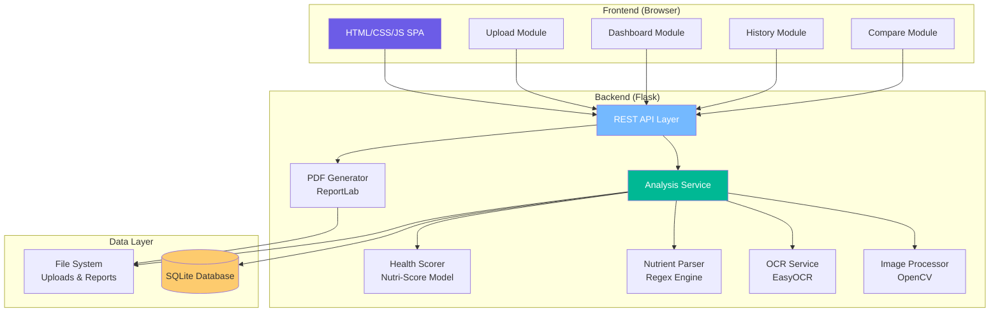
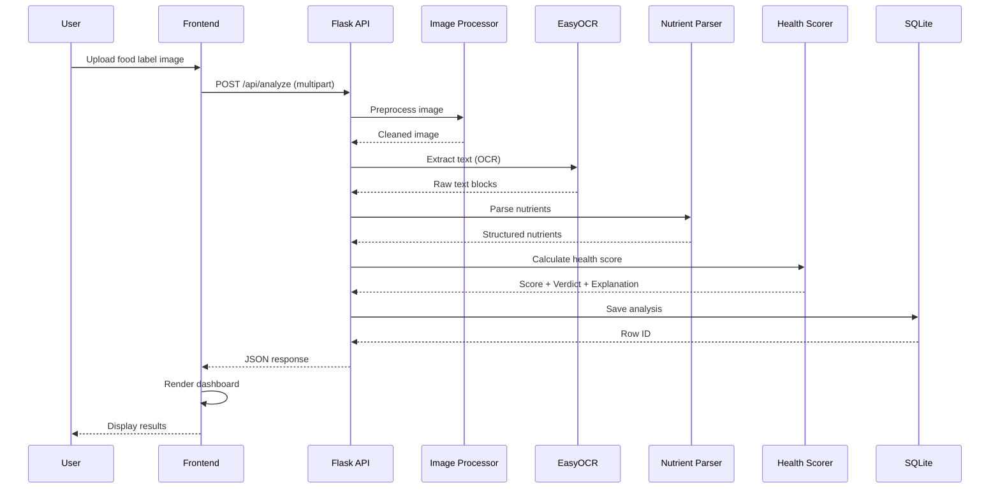
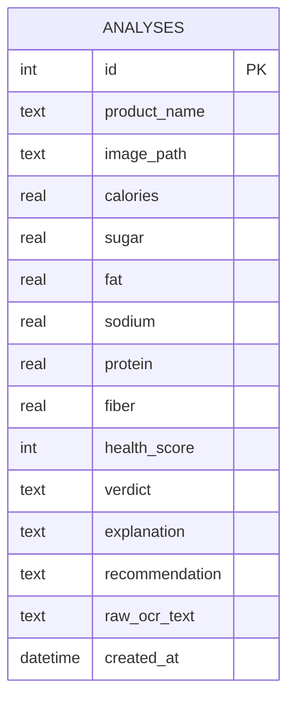
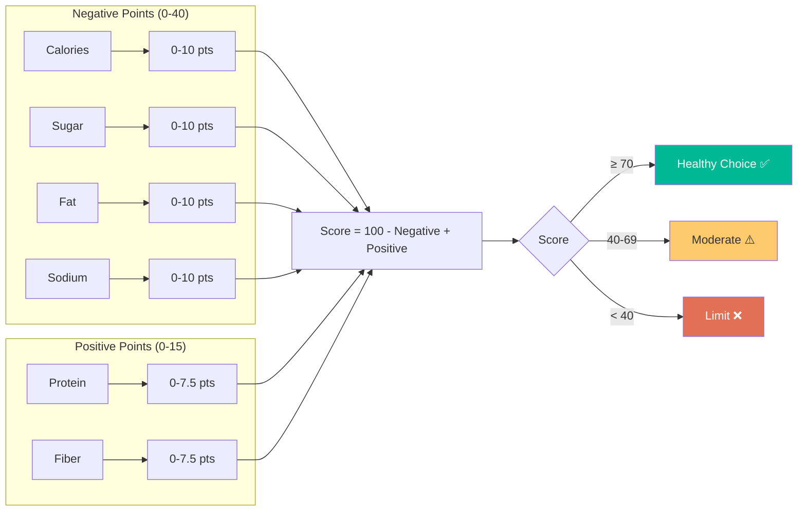

# NutriCheck – System Architecture

## High-Level Architecture



## Data Flow



## Folder Structure

```
NutriCheck/
├── app.py                      # Flask entry point & routes
├── config.py                   # Configuration constants
├── database.py                 # SQLite schema & CRUD
├── requirements.txt            # Python dependencies
├── models/
│   ├── health_scorer.py        # Nutri-Score hybrid model
│   └── nutrient_parser.py      # OCR text → nutrients
├── services/
│   ├── analysis_service.py     # Pipeline orchestrator
│   ├── image_processor.py      # OpenCV preprocessing
│   ├── ocr_service.py          # EasyOCR wrapper
│   └── pdf_service.py          # ReportLab PDF generation
├── static/
│   ├── css/style.css           # Dark glassmorphism theme
│   ├── js/
│   │   ├── app.js              # Main controller
│   │   ├── dashboard.js        # Gauge & nutrient rendering
│   │   ├── comparison.js       # Product comparison
│   │   └── history.js          # History management
│   ├── uploads/                # User-uploaded images
│   └── reports/                # Generated PDF reports
├── templates/
│   └── index.html              # SPA shell
└── docs/
    ├── architecture.md         # This file
    └── api.md                  # API documentation
```

## Database Schema



## Health Scoring Model


